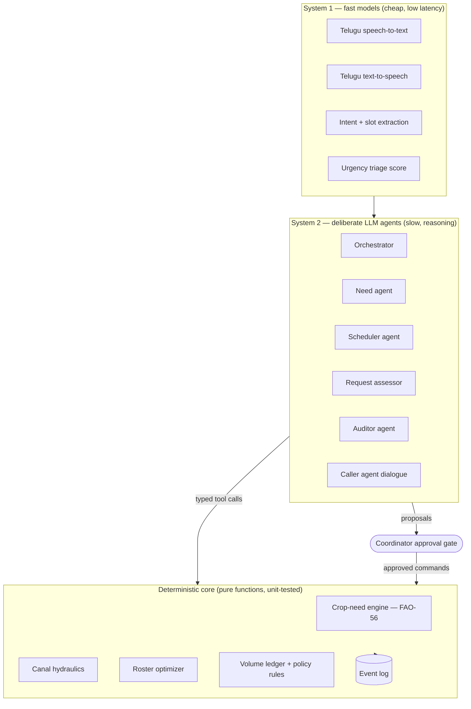

# Jadal — Architecture Overview

Status: DRAFT v0.1 (2026-10-01). Stack choices marked **[pending research]** are settled in `docs/decisions/`.

## 1. Design principle

**LLMs propose, the deterministic core decides the numbers, the coordinator approves.**

Every litre is computed by tested, deterministic code. LLM agents never do water arithmetic; they read and write only through typed tools that call the core. Every state change is an append-only event, so the ledger, the audit trail and the demo replay all come from one source.

## 2. Three layers

| Layer | Owns | Must never |
| --- | --- | --- |
| Deterministic core | Crop need, hydraulics, roster, ledger maths, policy rules (quota deduction, buffer) | Call an LLM |
| System 1 | Speech, intent extraction, fast triage scores | Change state directly |
| System 2 agents | Planning, negotiation, explanations, call dialogue | Compute volumes, or commit without approval (except pre-authorised actions such as sending reminders) |

## 3. Domain model

| Entity | Key fields |
| --- | --- |
| Canal | id, name, head discharge Q0 (m³/s), length, lining, seepage coefficient k, Manning n, slope, release windows |
| Outlet | id, canal_id, chainage x (m), farmer_ids |
| Farmer | id, name, phone, language, channel prefs (voice / WhatsApp / SMS), has_smartphone |
| Plot | id, farmer_id, outlet_id, area (ha), soil type, lat/lon |
| CropPlan | id, plot_id, crop, variety, sowing date, stage lengths, Kc curve, root depth, p |
| Entitlement | farmer_id, crop_plan_id, week, volume_m3 (approved), source (computed / edited) |
| ReleaseWindow | canal_id, start, end, discharge — from the irrigation department |
| Turn | outlet_id, farmer_id, start, end, planned_volume_m3, expected_flow_at_outlet |
| Request | id, farmer_id, type (urgent / buffer), volume_m3, reason, channel, status, triage_score, agent_recommendation, coordinator_decision |
| LedgerEntry | id, ts, account_from, account_to, volume_m3, reason, ref (request/turn/event) |
| Contact | id, farmer_id, channel, purpose, status (sent / delivered / acknowledged / failed), transcript_ref |

### Ledger accounts and the conservation rule

Accounts: `canal_supply`, `farmer:{id}:quota`, `farmer:{id}:delivered`, `buffer`, `losses:conveyance`, `losses:rain_saved` (moved to buffer).

Every movement is a double entry. At all times:
`season supply = Σ quotas + buffer + Σ delivered + conveyance losses`.
The auditor agent checks this invariant and flags violations.

| Event | Ledger movement |
| --- | --- |
| Season approved | canal_supply → farmer quotas, remainder → buffer |
| Turn delivered | farmer quota → farmer delivered (+ conveyance loss) |
| Urgent request approved | farmer quota (future weeks) → this week's turn |
| Week unused / declared not needed | farmer quota → buffer |
| Harvest declared | remaining farmer quota → buffer |
| Rain re-plan | reduced need → buffer |
| Buffer request approved | buffer → requesting farmer's turn |

## 4. Deterministic core

1. **Crop-need engine (FAO-56).** ET₀ from Open-Meteo (`et0_fao_evapotranspiration`), with Penman-Monteith as fallback → Kc curve by stage → ETc → effective rain → root-zone water balance (TAW, RAW, Dr) → net and gross irrigation → weekly m³ per plot. Per-crop min/max bounds per irrigation come from RAW and TAW. Spec: `docs/research/fao56-model.md`, `docs/research/fao56-crop-tables.md` **[pending research]**.
2. **Canal hydraulics.** Flow reaching outlet i: `Q_i = (Q0 − Σ upstream draw) · e^(−k·x_i)`; travel lag `x_i / v` with Manning's v; filling volume for a dry channel. Output: expected flow and lag per outlet.
3. **Roster optimizer.** Turn duration `T_i = V_i / Q_i + lag_i`. Pack turns into release windows, ordered head→tail, so tail turns start once the wetting front has arrived. Deterministic greedy algorithm first; LP (HiGHS) is an option. It also computes the overrun impact: a head overrun of Δt costs everyone downstream `Q·Δt`.
4. **Ledger + policy engine.** Double-entry volumes, quota deduction, buffer rules, request caps. These are pure functions over the event log.

## 5. Agents (System 2)

| Agent | Trigger | Tools (all deterministic) | Output | Human gate |
| --- | --- | --- | --- | --- |
| Orchestrator | Every event | Routes to other agents | Task plan | — |
| Intake | Portal form, voice, WhatsApp | `extract_registration`, `validate_plot` | Structured farmer, plot and crop records | Coordinator verifies registrations |
| Need | Season start, weekly, rain forecast | `crop_need`, `weather_forecast` | Proposed entitlements + explanation | Coordinator approves |
| Scheduler | Approved entitlements, release window | `hydraulics`, `optimize_roster`, `overrun_impact` | Proposed roster | Coordinator approves |
| Request assessor | New urgent or buffer request | `crop_stage_risk`, `quota_status`, `buffer_status`, `triage_score` | Recommendation + reasoning | Coordinator decides |
| Caller | Roster change, release alert, follow-up | `place_call`, `send_whatsapp`, `record_ack` | Acknowledgements, captured requests | Escalates unreachable farmers |
| Auditor | Daily and on demand | `ledger_invariants`, `delivered_vs_planned`, `gini` | Fairness report in plain language | — |

## 6. Communication flow

A roster change goes out to everyone affected. Each farmer must acknowledge it. The escalation ladder is: voice call → retry after 15 minutes → WhatsApp/SMS → flag to the coordinator. A release between 18:00 and 06:00 sends a WhatsApp message plus a warning call 1 hour before. Telephony and STT/TTS provider: **[pending research]**. The demo fallback is an in-browser simulated phone.

## 7. Runtime and deployment

Decided in `docs/decisions/ADR-001-004-stack.md`: one Hono Worker + static assets, D1 (event log + ledger, atomic `db.batch()` double entries), Workflows, Queues, Cron Triggers, KV, AI Gateway. TypeScript everywhere. CI/CD: GitHub Actions + `wrangler-action`.

## 8. Showcase

Showcasing is a first-class workstream:
- **Demo mode:** a seeded scenario (one minor canal, 8 farms) with a time-travel replay of the event log.
- **Hero visual:** the canal map, comparing "equal hours" (tail farm meets about 40% of need) with "equal water".
- **Live moment:** an urgent Telugu voice request → agent recommendation → coordinator approval → ledger deduction → affected farmers called → acknowledgements tick in.
- **Brag:** the latent-spaces/brag setup is **[pending research]**.
